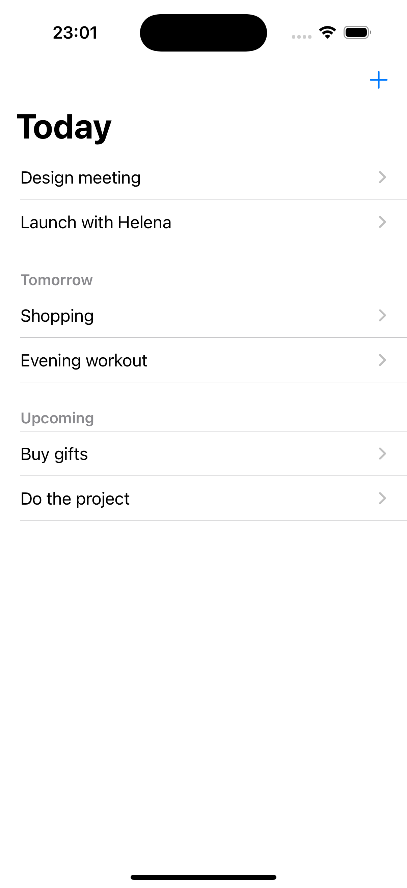
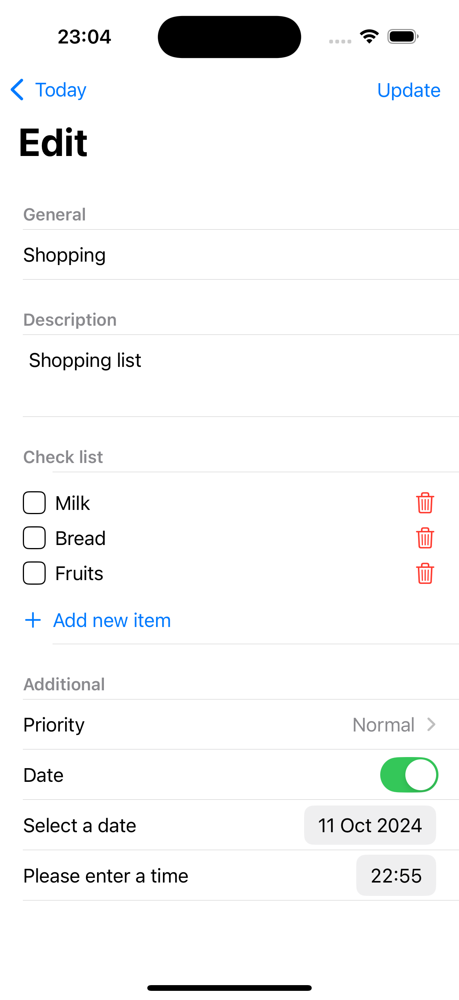
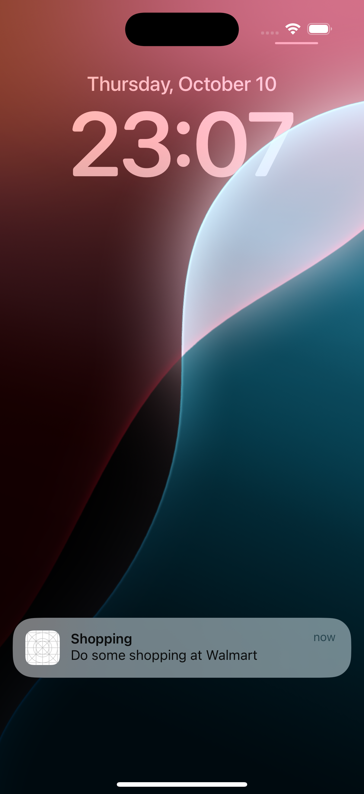

# Todo List App

This iOS application is a simple and intuitive to-do list manager that allows users to organize tasks efficiently. Users can add todos, descriptions, checklists, set reminders, and receive notifications to keep track of their tasks.

## Features

- **Add and Manage Todos**: Create todos with a title and detailed description.
- **Checklist**: Add items to a checklist under each todo, with the ability to check them off as done.
- **Reminders & Notifications**: Set reminders for todos and get notified at the appropriate time.
- **Easy-to-Use Interface**: A clean and minimal UI for managing todos and their details.

## Screenshots





## Getting Started

### Prerequisites

Before running the project, ensure you have the following:

- **Xcode 12 or later**
- **iOS 13.0 or later**
- **Swift 5.0**

### Installation

1. **Clone the repository**:

   ```bash
   git clone git@github.com:gheorghe96/simple-ios-todo.git
   cd todolist-app

   ```

1. **Run the app**:
   - Build and run the app in Xcode on an iOS simulator or a connected device.

## Requirements

- Xcode 12 or later
- iOS 13.0 or later
- Swift 5.0

## Contributing

Feel free to fork this repository and submit pull requests with new features, bug fixes, or suggestions. All contributions are welcome!

1. **Fork the repository.**

2. **Create a new branch:**:
   ```bash
   git checkout -b feature-branch
   ````
3. **Make your changes and commit them:**:
   ```bash
   git commit -m "Add new feature"
   ````
4. **Push to the branch:**:
   ```bash
   git push origin feature-branch
   ````
5. **Submit a pull request.**

## Contributing

Please report any bugs or suggestions in the Issues section. We appreciate your feedback!

Feel free to adjust it according to your project's details!
